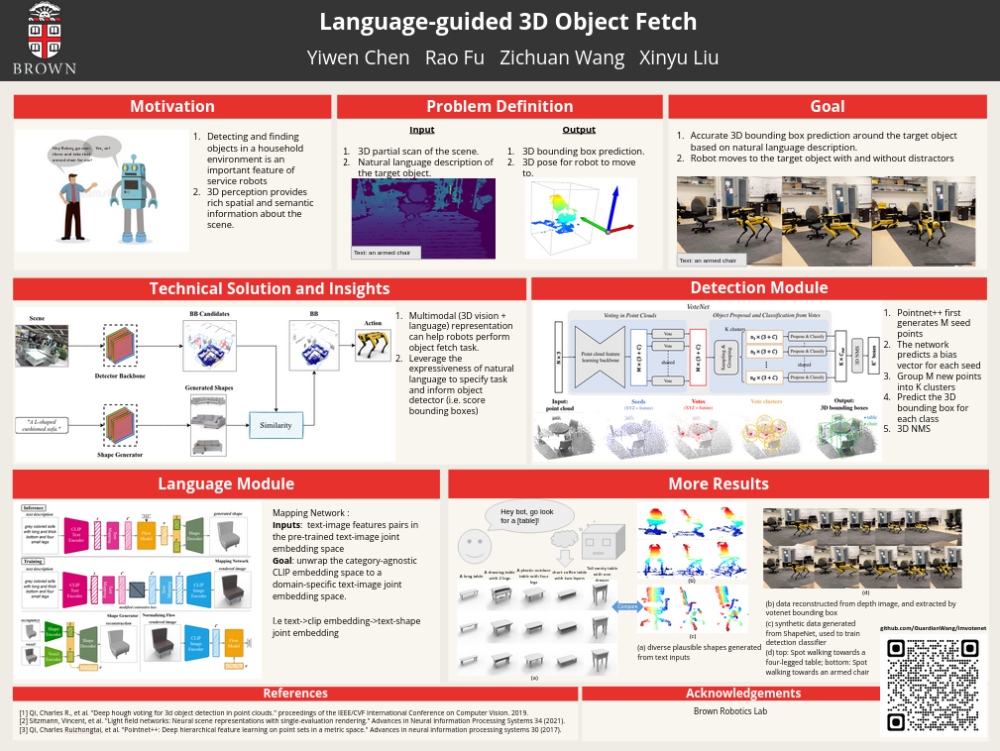

# RobotFetchMeIt
Brown university [CSCI 2952-O](http://cs.brown.edu/courses/csci2952o/) final project.

Given a depth map and a text description, we use [Spot](https://www.bostondynamics.com/products/spot)
to detect the object that matches the description in the scene and walk to it.

This repo is based on [imvotenet](https://github.com/facebookresearch/imvotenet).

# Group members

- [Zichuan Wang](https://github.com/GuardianWang)
- [Yiwen Chen](https://github.com/yiwenchen1999/)
- [Rao Fu](https://github.com/FreddieRao)
- [Xinyu Liu](https://github.com/jasonxyliu)

# Poster

[](https://docs.google.com/presentation/d/11A7Xm7krHcazY0S4bGPxj3i_MgMvHVn-/edit?usp=sharing&ouid=106174437514196571374&rtpof=true&sd=true)

# Demo

- Demo only with 3D object detector

[](https://youtu.be/LdnsRqQYvwg)

# Resources

- [spot-sdk](https://github.com/jasonxyliu/spot-sdk) for Spot API

# Installation

Clone this repository and submodules:
```bash
git clone https://github.com/GuardianWang/imvotenet.git RobotFetchMeIt
cd RobotFetchMeIt
git submodule init
```
We use conda to create a virtual environment.
Because loading the weights of text model requires pytorch>=1.8 and compiling pointnet2 requires pytorch==1.4, we are
using two conda environments.
```bash
conda create -n fetch python=3.7 -y
conda create -n torch18 python=3.7 -y
```
Overall, the installation is similar to [VoteNet](https://github.com/facebookresearch/votenet). 
GPU is required. The code is tested with Ubuntu 18.04, Python 3.7.13, PyTorch 1.4.0, CUDA 10.0, cuDNN v7.4, and NVIDIA GeForce RTX 2080.

Before installing Pytorch, make sure the machine has GPU on it. Check by `nvidia-smi`. 
We need GPU to compile PointNet++.
First install [PyTorch](https://pytorch.org/get-started/locally/), 
for example through [Anaconda](https://docs.anaconda.com/anaconda/install/):
Find cudatoolkit and cudnn version match [here](https://developer.nvidia.com/rdp/cudnn-archive).
Find how to let nvcc detect a specific cuda version [here](https://stackoverflow.com/questions/40517083/multiple-cuda-versions-on-machine-nvcc-v-confusion).
```bash
conda activate fetch
conda install pytorch==1.4.0 torchvision==0.5.0 cudatoolkit=9.2 cudnn=7.6.5 -c pytorch
pip install matplotlib opencv-python plyfile tqdm networkx==2.2 trimesh==2.35.39 protobuf
pip install open3d
pip install bosdyn-client bosdyn-mission bosdyn-choreography-client

conda activate torch18
conda install pytorch==1.8.0 torchvision==0.9.0 cudatoolkit=10.2 cudnn=7.6.5 -c pytorch
pip install ordered-set
pip install tqdm
pip install pandas
```

The code depends on [PointNet++](http://arxiv.org/abs/1706.02413) as a backbone, which needs compilation.
We need to compile by the [arch](https://arnon.dk/matching-sm-architectures-arch-and-gencode-for-various-nvidia-cards/) of GPU we want to use.
```bash
conda activate fetch
cd pointnet2
TORCH_CUDA_ARCH_LIST="7.5" python setup.py install
cd ..
```

# Model weights and data

- VoteNet weights (12 MB): checkpoint.tar
- Text model weights (1.4 GB): 
    ```bash
    bash download.sh 
    mv checkpoint.pth TextCondRobotFetch
    ``` 

# Run the demo

In terminal1, run
```bash
conda activate fetch
export ROBOT_IP=<your spot ip>
python estop_nogui.py $ROBOT_IP
```
You can force stop the spot by pressing `<space>`

In terminal2, run
```bash
conda activate fetch
export ROBOT_IP=<your spot ip>
export BOSDYN_CLIENT_USERNAME=<spot username>
export BOSDYN_CLIENT_PASSWORD=<spot password>
export BOSDYN_DOCK_ID=<spot dock id>
python predict_example.py --checkpoint_path checkpoint.tar --dump_dir pred_votenet --cluster_sampling seed_fps --use_3d_nms --use_cls_nms --per_class_proposal --time_per_move=5 --username $BOSDYN_CLIENT_USERNAME --password $BOSDYN_CLIENT_PASSWORD --dock_id $BOSDYN_DOCK_ID  $ROBOT_IP
```

In terminal3, run
```bash
conda activate torch18
export ROBOT_IP=<your spot ip>
python shape_inference.py --checkpoint TextCondRobotFetch/checkpoint.pth
```
You can specify the text and corresponding pre-extracted features by changing `latent_id` parameter passed to `pred_shape()`
in `shape_inference.py`. 
Texts and features are stored in `TextCondRobotFetch/embeddings`

# Train the detector yourself

Read [imvotenet](https://github.com/facebookresearch/imvotenet) to see how to train the detector.

# LICENSE

The code is released under the [MIT license](LICENSE).
